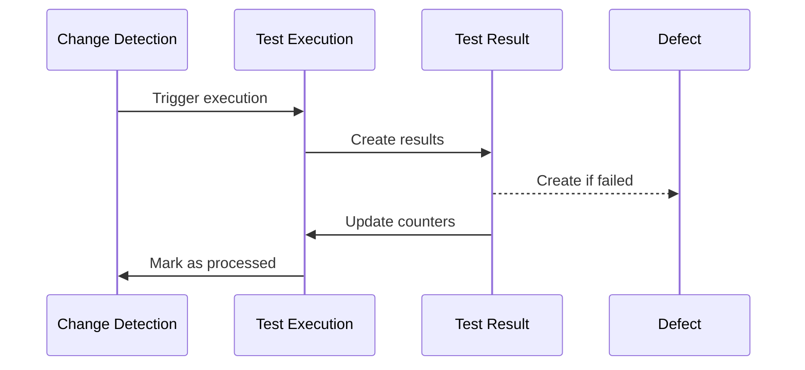

# 📘 HAIDA - Guía de Relaciones de Base de Datos

## **Índice**
1. [Arquitectura Multi-Tenant](#arquitectura-multi-tenant)
2. [Flujos de Datos Principales](#flujos-de-datos-principales)
3. [Queries Comunes](#queries-comunes)
4. [Reglas de Negocio](#reglas-de-negocio)
5. [Políticas RLS](#políticas-rls)
6. [Migraciones y Versionado](#migraciones-y-versionado)

---

## **1️⃣ Arquitectura Multi-Tenant**

HAIDA usa una arquitectura **multi-tenant con aislamiento a nivel de fila (RLS)**.

### **Jerarquía de Entidades**

```
Tenant (Organización)
  ├─ Tenant Members (Usuarios del tenant)
  ├─ Tenant Feature Flags (Configuración específica)
  ├─ Chat Providers (Configuración de IA)
  ├─ Projects (Proyectos de testing)
  │   ├─ Test Suites
  │   │   └─ Test Cases
  │   ├─ Change Detections
  │   │   └─ Test Executions
  │   │       └─ Test Results
  │   │           └─ Defects
  │   └─ Chat Threads
  │       └─ Chat Messages
  └─ Defects (Defectos generales)
```

### **Relaciones Clave**

| Desde | Hacia | Tipo | Cascade | Descripción |
|-------|-------|------|---------|-------------|
| `tenants` | `tenant_members` | 1:N | CASCADE | Un tenant tiene múltiples miembros |
| `tenants` | `projects` | 1:N | SET NULL | Proyectos pueden sobrevivir si se elimina el tenant |
| `projects` | `test_suites` | 1:N | CASCADE | Suites eliminadas con proyecto |
| `test_suites` | `test_cases` | 1:N | CASCADE | Casos eliminados con suite |
| `test_executions` | `test_results` | 1:N | CASCADE | Resultados eliminados con ejecución |
| `test_results` | `test_cases` | N:1 | SET NULL | Referencia opcional a caso |
| `chat_threads` | `chat_messages` | 1:N | CASCADE | Mensajes eliminados con thread |

---

## **2️⃣ Flujos de Datos Principales**

### **A. Ciclo de Vida de Testing**



**Flujo SQL**:

```sql
-- 1. Se detecta un cambio
INSERT INTO change_detections (project_id, url, change_type, status)
VALUES ('proj-uuid', 'https://example.com', 'deployment', 'pending');

-- 2. Se crea una ejecución
INSERT INTO test_executions (project_id, change_detection_id, status)
VALUES ('proj-uuid', 'cd-uuid', 'running');

-- 3. Se ejecutan tests y se crean resultados
INSERT INTO test_results (test_execution_id, test_case_id, status)
VALUES ('exec-uuid', 'case-uuid', 'failed');

-- 4. Si falla, se crea un defect automáticamente
INSERT INTO defects (
  project_id, 
  test_execution_id, 
  test_result_id, 
  title, 
  severity
)
VALUES (
  'proj-uuid', 
  'exec-uuid', 
  'result-uuid', 
  'Test failed: Login validation', 
  'high'
);

-- 5. Se actualiza el execution con contadores
UPDATE test_executions
SET 
  total_tests = (SELECT COUNT(*) FROM test_results WHERE test_execution_id = 'exec-uuid'),
  failed_tests = (SELECT COUNT(*) FROM test_results WHERE test_execution_id = 'exec-uuid' AND status = 'failed'),
  passed_tests = (SELECT COUNT(*) FROM test_results WHERE test_execution_id = 'exec-uuid' AND status = 'passed'),
  status = 'completed',
  completed_at = NOW()
WHERE id = 'exec-uuid';
```

### **B. Chat IA con Contexto**

```sql
-- 1. Usuario inicia conversación en un proyecto
INSERT INTO chat_threads (tenant_id, project_id, user_id, provider, status)
VALUES ('tenant-uuid', 'proj-uuid', 'user-uuid', 'copilot-studio', 'active');

-- 2. Se envían mensajes alternados
INSERT INTO chat_messages (thread_id, role, content, content_type)
VALUES 
  ('thread-uuid', 'user', '¿Cuántos tests fallaron hoy?', 'text'),
  ('thread-uuid', 'assistant', 'Hoy han fallado 3 tests en total...', 'markdown');

-- 3. Obtener historial con contexto de proyecto
SELECT 
  cm.content,
  cm.role,
  cm.created_at,
  ct.title AS thread_title,
  p.name AS project_name
FROM chat_messages cm
JOIN chat_threads ct ON cm.thread_id = ct.id
LEFT JOIN projects p ON ct.project_id = p.id
WHERE ct.user_id = 'user-uuid'
ORDER BY cm.created_at DESC
LIMIT 50;
```

### **C. Feature Flags con Herencia**

```
Global Flag (default_value)
  ├─ Tenant Override (tenant_feature_flags)
  └─ User Override (user_feature_flags)
```

**Prioridad**: User > Tenant > Global

```sql
-- Función para resolver feature flag con herencia
CREATE OR REPLACE FUNCTION resolve_feature_flag(
  p_user_id uuid,
  p_tenant_id uuid,
  p_flag_key text
) RETURNS jsonb AS $$
DECLARE
  v_value jsonb;
BEGIN
  -- 1. Primero buscar override de usuario
  SELECT value INTO v_value
  FROM user_feature_flags
  WHERE user_id = p_user_id 
    AND flag_key = p_flag_key
    AND is_enabled = true;
  
  IF FOUND THEN RETURN v_value; END IF;
  
  -- 2. Luego override de tenant
  SELECT value INTO v_value
  FROM tenant_feature_flags
  WHERE tenant_id = p_tenant_id 
    AND flag_key = p_flag_key
    AND is_enabled = true;
  
  IF FOUND THEN RETURN v_value; END IF;
  
  -- 3. Por último, valor global por defecto
  SELECT default_value INTO v_value
  FROM feature_flags
  WHERE key = p_flag_key
    AND is_active = true;
  
  RETURN COALESCE(v_value, 'false'::jsonb);
END;
$$ LANGUAGE plpgsql SECURITY DEFINER;
```

---

## **3️⃣ Queries Comunes**

### **A. Dashboard de Proyecto**

```sql
-- Salud general del proyecto con todas las métricas
SELECT 
  p.id,
  p.name,
  p.slug,
  
  -- Test Suites
  (SELECT COUNT(*) FROM test_suites WHERE project_id = p.id) AS total_suites,
  
  -- Test Cases
  (SELECT COUNT(*) FROM test_cases tc 
   JOIN test_suites ts ON tc.test_suite_id = ts.id 
   WHERE ts.project_id = p.id) AS total_cases,
  
  (SELECT COUNT(*) FROM test_cases tc 
   JOIN test_suites ts ON tc.test_suite_id = ts.id 
   WHERE ts.project_id = p.id AND tc.is_automated = true) AS automated_cases,
  
  -- Executions (últimas 30 días)
  (SELECT COUNT(*) FROM test_executions 
   WHERE project_id = p.id 
   AND started_at >= NOW() - INTERVAL '30 days') AS executions_last_30d,
  
  (SELECT COUNT(*) FROM test_executions 
   WHERE project_id = p.id 
   AND status = 'failed'
   AND started_at >= NOW() - INTERVAL '30 days') AS failed_executions_last_30d,
  
  -- Defects abiertos
  (SELECT COUNT(*) FROM defects 
   WHERE project_id = p.id 
   AND status IN ('open', 'in_progress')) AS open_defects,
  
  -- Última ejecución
  (SELECT started_at FROM test_executions 
   WHERE project_id = p.id 
   ORDER BY started_at DESC LIMIT 1) AS last_execution_at,
  
  -- Tasa de éxito promedio
  (SELECT 
    CASE 
      WHEN SUM(total_tests) = 0 THEN 0
      ELSE ROUND(100.0 * SUM(passed_tests) / SUM(total_tests), 2)
    END
   FROM test_executions
   WHERE project_id = p.id
   AND completed_at >= NOW() - INTERVAL '30 days') AS success_rate_30d
   
FROM projects p
WHERE p.id = 'project-uuid';
```

### **B. Test Coverage por Suite**

```sql
-- Usar la vista creada
SELECT * FROM v_test_coverage
WHERE project_id = 'project-uuid'
ORDER BY automation_percentage DESC;

-- O query completa
SELECT 
  ts.id,
  ts.name,
  ts.suite_type,
  COUNT(tc.id) AS total_cases,
  COUNT(tc.id) FILTER (WHERE tc.is_automated = true) AS automated,
  COUNT(tc.id) FILTER (WHERE tc.is_automated = false OR tc.is_automated IS NULL) AS manual,
  ROUND(100.0 * COUNT(tc.id) FILTER (WHERE tc.is_automated = true) / NULLIF(COUNT(tc.id), 0), 2) AS automation_pct
FROM test_suites ts
LEFT JOIN test_cases tc ON tc.test_suite_id = ts.id
WHERE ts.project_id = 'project-uuid'
GROUP BY ts.id, ts.name, ts.suite_type
ORDER BY automation_pct DESC;
```

### **C. Defects por Severidad (Últimos 7 días)**

```sql
SELECT 
  severity,
  status,
  COUNT(*) AS count,
  ARRAY_AGG(title ORDER BY created_at DESC) FILTER (WHERE title IS NOT NULL) AS recent_titles
FROM defects
WHERE project_id = 'project-uuid'
  AND created_at >= NOW() - INTERVAL '7 days'
GROUP BY severity, status
ORDER BY 
  CASE severity
    WHEN 'critical' THEN 1
    WHEN 'high' THEN 2
    WHEN 'medium' THEN 3
    WHEN 'low' THEN 4
  END;
```

### **D. Rate Limiting: Verificar límites**

```sql
-- Contar requests en ventana de 1 hora
SELECT 
  user_id,
  endpoint,
  SUM(request_count) AS total_requests,
  MAX(blocked_until) AS blocked_until
FROM rate_limit_counters
WHERE tenant_id = 'tenant-uuid'
  AND window_start >= NOW() - INTERVAL '1 hour'
GROUP BY user_id, endpoint
HAVING SUM(request_count) > 1000; -- Límite por hora
```

---

## **4️⃣ Reglas de Negocio**

### **A. Validaciones en Base de Datos**

#### **Triggers Activos**

1. **`update_updated_at_column`** - Actualiza `updated_at` automáticamente
   - Tablas: `users`, `projects`, `test_suites`, `tenants`, etc.

2. **`calculate_execution_duration`** - Calcula `duration_ms` al completar
   - Tabla: `test_executions`

```sql
-- Trigger de duración
CREATE OR REPLACE FUNCTION calculate_execution_duration()
RETURNS trigger LANGUAGE plpgsql AS $$
BEGIN
  IF NEW.completed_at IS NOT NULL AND NEW.started_at IS NOT NULL THEN
    NEW.duration_ms = EXTRACT(EPOCH FROM (NEW.completed_at - NEW.started_at)) * 1000;
  END IF;
  RETURN NEW;
END;
$$;
```

### **B. Constraints de Integridad**

- **Severidad de defectos**: Solo `critical|high|medium|low`
- **Prioridad de defectos**: Solo `p0|p1|p2|p3|p4`
- **Status de ejecución**: Solo `pending|running|completed|failed|cancelled`
- **Tenant size**: Solo `startup|small|medium|large|enterprise`
- **Rollout percentage**: Entre 0 y 100

### **C. Defaults Importantes**

| Tabla | Columna | Default | Razón |
|-------|---------|---------|-------|
| `tenants` | `subscription_plan` | `'free'` | Trial por defecto |
| `tenants` | `subscription_status` | `'active'` | Activación inmediata |
| `tenants` | `settings` | `{max_users: 100, ...}` | Límites iniciales |
| `user_profiles` | `preferences` | `{theme: 'light', ...}` | UX por defecto |
| `test_executions` | `environment` | `'staging'` | Entorno seguro |
| `defects` | `severity` | `'medium'` | Prioridad media |
| `feature_flags` | `is_active` | `false` | Opt-in por seguridad |

---

## **5️⃣ Políticas RLS**

### **Políticas Implementadas**

#### **Tenants**
```sql
-- SELECT: Solo tenants donde el usuario es miembro
CREATE POLICY tenants_select ON tenants
FOR SELECT TO authenticated
USING (
  (auth.jwt() ->> 'role') = 'automation' -- Bypass para automation
  OR
  (auth.uid()) IN (
    SELECT user_id FROM tenant_members
    WHERE tenant_id = tenants.id
  )
);

-- UPDATE: Solo admins/owners del tenant
CREATE POLICY tenants_update ON tenants
FOR UPDATE TO authenticated
USING (
  (auth.jwt() ->> 'role') = 'automation'
  OR
  (auth.uid()) IN (
    SELECT user_id FROM tenant_members
    WHERE tenant_id = tenants.id
      AND role IN ('owner', 'admin')
  )
);
```

#### **Chat Threads**
```sql
-- SELECT: Solo threads del tenant del usuario o propios
CREATE POLICY chat_threads_select ON chat_threads
FOR SELECT TO authenticated
USING (
  (auth.jwt() ->> 'role') = 'automation'
  OR
  tenant_id = (auth.jwt() ->> 'tenant_id')::uuid
  OR
  user_id = (auth.uid())
);
```

### **Funciones Helper para RLS**

```sql
-- Obtener tenant del usuario actual
CREATE OR REPLACE FUNCTION get_user_tenant()
RETURNS uuid AS $$
  SELECT (auth.jwt() ->> 'tenant_id')::uuid;
$$ LANGUAGE sql STABLE SECURITY DEFINER;

-- Verificar si es miembro de un tenant
CREATE OR REPLACE FUNCTION is_tenant_member(p_tenant_id uuid)
RETURNS boolean AS $$
  SELECT EXISTS (
    SELECT 1 FROM tenant_members
    WHERE tenant_id = p_tenant_id
      AND user_id = (auth.uid())
  );
$$ LANGUAGE sql STABLE SECURITY DEFINER;
```

---

## **6️⃣ Migraciones y Versionado**

### **Convención de Nombres**

```
supabase/migrations/
  ├─ 20250120000001_initial_schema.sql
  ├─ 20250120000002_add_feature_flags.sql
  ├─ 20250120000003_add_rls_policies.sql
  └─ 20250120000004_add_rate_limiting.sql
```

### **Template de Migración**

```sql
-- Migration: [Nombre descriptivo]
-- Date: YYYY-MM-DD
-- Description: [Qué hace esta migración]

BEGIN;

-- ============================================
-- CAMBIOS DE ESQUEMA
-- ============================================

-- Crear tablas
CREATE TABLE IF NOT EXISTS ...;

-- Agregar columnas
ALTER TABLE ... ADD COLUMN IF NOT EXISTS ...;

-- Crear índices
CREATE INDEX IF NOT EXISTS idx_... ON ...;

-- ============================================
-- FUNCIONES Y TRIGGERS
-- ============================================

CREATE OR REPLACE FUNCTION ...;

-- ============================================
-- RLS POLICIES
-- ============================================

ALTER TABLE ... ENABLE ROW LEVEL SECURITY;
CREATE POLICY ... ON ... FOR SELECT ...;

-- ============================================
-- SEED DATA (opcional)
-- ============================================

INSERT INTO ... VALUES ... ON CONFLICT DO NOTHING;

COMMIT;
```

### **Rollback Strategy**

Cada migración debe tener su rollback correspondiente:

```sql
-- rollback_20250120000004.sql
BEGIN;

DROP TABLE IF EXISTS rate_limit_counters CASCADE;
DROP TABLE IF EXISTS rate_limit_policies CASCADE;

COMMIT;
```

---

## **📚 Recursos Adicionales**

- [Diagrama ER Completo](./HAIDA_DATABASE_DIAGRAM.md)
- [Tipos TypeScript](./src/types/database.types.ts)
- [Esquema SQL](./haida_schema.sql)
- [Script de Remediación RLS](./remediation.sql)

---

**Última actualización**: 2025-01-20  
**Autor**: HAIDA Engineering Team  
**Versión**: 1.0.0
