# 🗄️ HAIDA - Diagrama de Base de Datos

## **Diagrama Entidad-Relación (ER)**

```mermaid
erDiagram
    %% ========================================
    %% MULTI-TENANCY CORE
    %% ========================================
    
    tenants ||--o{ tenant_members : "has"
    tenants ||--o{ tenant_feature_flags : "has"
    tenants ||--o{ chat_providers : "configures"
    tenants ||--o{ chat_threads : "owns"
    tenants ||--o{ defects : "tracks"
    tenants ||--o{ rate_limit_counters : "monitors"
    
    tenants {
        uuid id PK
        text name
        text slug UK
        text description
        text logo_url
        text website_url
        text industry
        text size
        text timezone
        text locale
        jsonb settings
        text subscription_plan
        text subscription_status
        timestamptz created_at
        timestamptz updated_at
    }
    
    tenant_members {
        uuid tenant_id PK,FK
        uuid user_id PK,FK
        text role
        uuid invited_by
        timestamptz invited_at
        timestamptz joined_at
        timestamptz last_active_at
        jsonb permissions
    }
    
    %% ========================================
    %% USER MANAGEMENT
    %% ========================================
    
    users ||--o{ projects : "owns"
    users ||--o{ test_suites : "creates"
    users ||--o{ test_cases : "creates"
    users ||--o{ defects : "reports"
    users ||--o{ defects : "assigned_to"
    
    users {
        uuid id PK
        varchar email UK
        varchar name
        varchar role
        boolean is_active
        timestamptz created_at
        timestamptz updated_at
        timestamptz last_login_at
        jsonb metadata
    }
    
    user_profiles {
        uuid id PK,FK
        text email UK
        text full_name
        text avatar_url
        text bio
        text job_title
        text department
        text phone
        text timezone
        text locale
        jsonb preferences
        timestamptz last_login_at
        int login_count
        timestamptz created_at
        timestamptz updated_at
    }
    
    user_sso_providers {
        uuid user_id PK,FK
        text provider PK
        text provider_id
        jsonb provider_data
        timestamptz linked_at
        timestamptz last_used_at
    }
    
    %% ========================================
    %% RBAC (Roles & Permissions)
    %% ========================================
    
    roles ||--o{ role_permissions : "has"
    permissions ||--o{ role_permissions : "granted_by"
    
    roles {
        uuid id PK
        text name UK
        text display_name
        text description
        boolean is_system_role
        jsonb permissions
        timestamptz created_at
    }
    
    permissions {
        uuid id PK
        text name UK
        text resource
        text action
        text description
        timestamptz created_at
    }
    
    role_permissions {
        uuid role_id PK,FK
        uuid permission_id PK,FK
        uuid granted_by
        timestamptz granted_at
    }
    
    %% ========================================
    %% FEATURE FLAGS
    %% ========================================
    
    feature_flags ||--o{ tenant_feature_flags : "overrides"
    feature_flags ||--o{ user_feature_flags : "overrides"
    
    feature_flags {
        text key PK
        text name
        text description
        text type
        jsonb default_value
        int rollout_percentage
        boolean is_active
        uuid created_by
        timestamptz created_at
        timestamptz updated_at
    }
    
    tenant_feature_flags {
        uuid tenant_id PK,FK
        text flag_key PK,FK
        jsonb value
        boolean is_enabled
        int rollout_percentage
        uuid set_by
        timestamptz set_at
    }
    
    user_feature_flags {
        uuid user_id PK,FK
        text flag_key PK,FK
        jsonb value
        boolean is_enabled
        uuid set_by
        timestamptz set_at
    }
    
    %% ========================================
    %% PROJECTS & TESTING
    %% ========================================
    
    projects ||--o{ test_suites : "contains"
    projects ||--o{ change_detections : "monitors"
    projects ||--o{ test_executions : "runs"
    projects ||--o{ chat_threads : "discusses"
    
    projects {
        uuid id PK
        varchar name
        varchar slug UK
        text description
        varchar base_url
        varchar repository_url
        varchar status
        uuid owner_id FK
        timestamptz created_at
        timestamptz updated_at
        jsonb settings
        jsonb metadata
    }
    
    test_suites ||--o{ test_cases : "contains"
    
    test_suites {
        uuid id PK
        uuid project_id FK
        varchar name
        text description
        varchar suite_type
        varchar priority
        text[] tags
        boolean is_active
        uuid created_by FK
        timestamptz created_at
        timestamptz updated_at
        jsonb metadata
    }
    
    test_cases {
        uuid id PK
        uuid test_suite_id FK
        varchar test_id UK
        varchar name
        text description
        varchar test_type
        varchar component
        varchar module
        text[] requirement_ids
        text preconditions
        text test_steps
        text expected_result
        varchar priority
        varchar risk_level
        boolean is_automated
        varchar automation_script_path
        varchar automation_framework
        varchar status
        text[] tags
        uuid created_by FK
        timestamptz created_at
        timestamptz updated_at
        jsonb metadata
    }
    
    %% ========================================
    %% TEST EXECUTION
    %% ========================================
    
    change_detections ||--o{ test_executions : "triggers"
    test_executions ||--o{ test_results : "produces"
    test_executions ||--o{ defects : "finds"
    
    change_detections {
        uuid id PK
        uuid project_id FK
        varchar url
        varchar tag
        varchar change_type
        varchar previous_md5
        varchar current_md5
        text diff_summary
        jsonb webhook_payload
        varchar selected_test_profile
        uuid[] test_suite_ids
        varchar status
        timestamptz processed_at
        timestamptz detected_at
        timestamptz created_at
        jsonb metadata
    }
    
    test_executions {
        uuid id PK
        uuid project_id FK
        uuid change_detection_id FK
        varchar execution_type
        varchar trigger_source
        varchar environment
        varchar browser
        varchar platform
        varchar status
        timestamptz started_at
        timestamptz completed_at
        int duration_ms
        int total_tests
        int passed_tests
        int failed_tests
        int skipped_tests
        varchar allure_report_url
        varchar playwright_report_url
        varchar artifacts_path
        uuid triggered_by FK
        jsonb metadata
    }
    
    test_results ||--o| test_cases : "tests"
    test_results ||--o{ defects : "creates"
    
    test_results {
        uuid id PK
        uuid test_execution_id FK
        uuid test_case_id FK
        varchar test_name
        varchar test_file
        varchar test_id_ref
        varchar status
        text error_message
        text error_stack
        int duration_ms
        int retries
        varchar screenshot_url
        varchar video_url
        varchar trace_url
        text logs
        int assertions_passed
        int assertions_failed
        timestamptz started_at
        timestamptz completed_at
        timestamptz created_at
        jsonb metadata
    }
    
    %% ========================================
    %% DEFECT TRACKING
    %% ========================================
    
    defects {
        uuid id PK
        uuid tenant_id FK
        uuid project_id FK
        uuid test_execution_id FK
        uuid test_result_id FK
        text title
        text description
        text severity
        text priority
        text status
        text external_issue_id
        text external_url
        uuid assigned_to FK
        uuid reported_by FK
        text steps_to_reproduce
        text expected_behavior
        text actual_behavior
        text environment
        text browser
        text os_version
        jsonb attachments
        text[] tags
        jsonb metadata
        timestamptz resolved_at
        timestamptz created_at
        timestamptz updated_at
    }
    
    %% ========================================
    %% CHAT IA
    %% ========================================
    
    chat_threads ||--o{ chat_messages : "contains"
    
    chat_threads {
        uuid id PK
        uuid tenant_id FK
        uuid project_id FK
        uuid user_id FK
        text title
        text provider
        text thread_id UK
        text status
        jsonb metadata
        timestamptz created_at
        timestamptz updated_at
    }
    
    chat_messages {
        uuid id PK
        uuid thread_id FK
        text role
        text content
        text content_type
        jsonb attachments
        jsonb metadata
        timestamptz created_at
    }
    
    chat_providers {
        uuid tenant_id PK,FK
        text provider PK
        boolean is_active
        jsonb config
        jsonb usage_limits
        uuid created_by
        timestamptz created_at
        timestamptz updated_at
    }
    
    %% ========================================
    %% RATE LIMITING
    %% ========================================
    
    rate_limit_policies {
        uuid id PK
        text name UK
        text description
        int requests_per_minute
        int requests_per_hour
        int burst_limit
        text applies_to
        boolean is_active
        timestamptz created_at
    }
    
    rate_limit_counters {
        uuid user_id PK
        uuid tenant_id PK,FK
        text endpoint PK
        timestamptz window_start PK
        int request_count
        timestamptz blocked_until
        timestamptz created_at
    }
    
    %% ========================================
    %% AUDIT
    %% ========================================
    
    event_logs {
        uuid id PK
        uuid user_id FK
        text event_type
        text message
        jsonb metadata
        timestamptz created_at
    }
```



---

## **📊 Resumen de Relaciones**

### **1️⃣ Multi-Tenancy (1:N)**
- `tenants` → `tenant_members` (Un tenant tiene múltiples miembros)
- `tenants` → `tenant_feature_flags` (Feature flags por tenant)
- `tenants` → `chat_providers` (Configuración de IAs por tenant)
- `tenants` → `chat_threads` (Conversaciones del tenant)
- `tenants` → `defects` (Defectos rastreados por tenant)

### **2️⃣ Usuarios (1:N)**
- `users` → `projects` (owner_id)
- `users` → `test_suites` (created_by)
- `users` → `test_cases` (created_by)
- `users` → `defects` (reported_by, assigned_to)
- `users` → `test_executions` (triggered_by)

### **3️⃣ Proyectos & Testing (1:N en cascada)**
- `projects` → `test_suites` → `test_cases`
- `projects` → `change_detections` → `test_executions` → `test_results`
- `test_executions` → `defects`
- `test_results` → `test_cases` (referencia)

### **4️⃣ Chat IA (1:N)**
- `chat_threads` → `chat_messages`
- `tenants` → `chat_providers` (configuración)
- `projects` → `chat_threads` (contexto de proyecto)

### **5️⃣ RBAC (M:N)**
- `roles` ↔ `permissions` (via `role_permissions`)

### **6️⃣ Feature Flags (1:N)**
- `feature_flags` → `tenant_feature_flags`
- `feature_flags` → `user_feature_flags`

---

## **🔑 Claves Importantes**

### **Primary Keys**
- Todas las tablas principales usan `uuid` como PK
- Algunas usan PKs compuestas (tenant_members, role_permissions, etc.)

### **Foreign Keys con CASCADE**
- `tenant_members.tenant_id` → `tenants.id` (ON DELETE CASCADE)
- `test_suites.project_id` → `projects.id` (ON DELETE CASCADE)
- `test_cases.test_suite_id` → `test_suites.id` (ON DELETE CASCADE)
- `test_results.test_execution_id` → `test_executions.id` (ON DELETE CASCADE)
- `chat_messages.thread_id` → `chat_threads.id` (ON DELETE CASCADE)

### **Foreign Keys con SET NULL**
- `defects.tenant_id` → `tenants.id` (ON DELETE SET NULL)
- `projects.owner_id` → `users.id` (ON DELETE SET NULL)
- `test_results.test_case_id` → `test_cases.id` (ON DELETE SET NULL)

---

## **🎯 Índices Recomendados (Para RLS y Performance)**

```sql
-- Multi-tenancy
CREATE INDEX idx_tenant_members_tenant_id ON tenant_members(tenant_id);
CREATE INDEX idx_tenant_members_user_id ON tenant_members(user_id);
CREATE INDEX idx_defects_tenant_id ON defects(tenant_id);
CREATE INDEX idx_chat_threads_tenant_id ON chat_threads(tenant_id);

-- Proyectos y testing
CREATE INDEX idx_test_suites_project_id ON test_suites(project_id);
CREATE INDEX idx_test_cases_suite_id ON test_cases(test_suite_id);
CREATE INDEX idx_test_executions_project_id ON test_executions(project_id);
CREATE INDEX idx_test_results_execution_id ON test_results(test_execution_id);
CREATE INDEX idx_test_results_case_id ON test_results(test_case_id);

-- Chat
CREATE INDEX idx_chat_messages_thread_id ON chat_messages(thread_id);
CREATE INDEX idx_chat_threads_user_id ON chat_threads(user_id);

-- Búsquedas comunes
CREATE INDEX idx_projects_slug ON projects(slug);
CREATE INDEX idx_test_cases_test_id ON test_cases(test_id);
CREATE INDEX idx_defects_status ON defects(status);
CREATE INDEX idx_test_executions_status ON test_executions(status);

-- Rate limiting
CREATE INDEX idx_rate_limit_counters_lookup ON rate_limit_counters(user_id, tenant_id, endpoint, window_start);
```

---

## **🔒 Políticas RLS Activas**

Según `remediation.sql`, estas tablas tienen RLS habilitado:
- ✅ `tenants`
- ✅ `tenant_members`
- ✅ `user_profiles`
- ✅ `tenant_feature_flags`
- ✅ `user_feature_flags`
- ✅ `defects`
- ✅ `chat_threads`
- ✅ `chat_messages`
- ✅ `rate_limit_counters`
- ✅ `event_logs`

**Políticas Base**:
- `automation` role bypasses RLS
- Users can only access tenants where they are members
- Chat threads restricted to tenant members or thread owner
- Tenant admins/owners can update tenant settings

---

## **📈 Vistas Materializadas Disponibles**

1. **`v_project_health`** - Métricas agregadas por proyecto
2. **`v_test_coverage`** - Porcentaje de automatización por suite
3. **`v_recent_executions`** - Últimas 100 ejecuciones

---

## **🚀 Extensiones PostgreSQL Usadas**

- `pgcrypto` - Generación de UUIDs y encriptación
- `pg_trgm` - Búsquedas de texto similares
- `pg_stat_statements` - Monitoreo de queries
- `pg_cron` - Jobs programados
- `vector` - Embeddings para IA (similarity search)
- `http` - Requests HTTP desde DB
- `uuid-ossp` - Generación de UUIDs

---

**Generado**: 2025-01-20  
**Proyecto**: HAIDA Quality Assurance Platform  
**Versión**: 1.0
