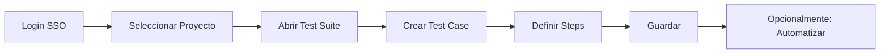
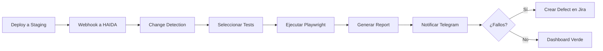

# 📚 01 - Fundamentos de HAIDA

**Introducción completa a la plataforma de QA empresarial**

---

## **¿Qué es HAIDA?**

HAIDA es una **plataforma de Quality Assurance empresarial** diseñada para:

✅ **Automatizar testing** de aplicaciones web  
✅ **Detectar cambios** en deployments y ejecutar tests automáticamente  
✅ **Gestionar defectos** con integración a Jira  
✅ **Notificaciones inteligentes** vía Telegram Bot  
✅ **Chat IA integrado** tipo Microsoft 365 Copilot  
✅ **Multi-tenant** con SSO empresarial (Microsoft 365)  

---

## **🎯 Conceptos Clave**

### **1. Proyectos (Projects)**
Contenedores de alto nivel que agrupan test suites, casos y ejecuciones.

```typescript
interface Project {
  id: string;
  name: string;
  slug: string;
  base_url: string;      // URL base del sitio a testear
  repository_url: string;
  status: 'active' | 'inactive' | 'archived';
  owner_id: string;
}
```

### **2. Test Suites**
Colecciones de test cases agrupados por funcionalidad o módulo.

```typescript
interface TestSuite {
  id: string;
  project_id: string;
  name: string;
  suite_type: 'smoke' | 'regression' | 'integration' | 'e2e';
  priority: 'critical' | 'high' | 'medium' | 'low';
  is_automated: boolean;
}
```

### **3. Test Cases**
Pruebas individuales con pasos, precondiciones y resultado esperado.

```typescript
interface TestCase {
  id: string;
  test_suite_id: string;
  test_id: string;         // ID custom (ej: "TC-001")
  name: string;
  preconditions: string;
  test_steps: string;
  expected_result: string;
  is_automated: boolean;
  automation_framework: 'playwright' | 'cypress' | 'selenium';
}
```

### **4. Change Detection**
Sistema que detecta cambios en deployments y ejecuta tests automáticamente.

**Flujo**:
1. Webhook recibe notificación de deployment
2. Se analiza el cambio (diff de URLs, tags)
3. Se selecciona el test profile apropiado
4. Se ejecutan los tests automáticamente
5. Se generan reportes (Allure/Playwright)

### **5. Test Executions**
Ejecuciones de tests con resultados agregados.

```typescript
interface TestExecution {
  id: string;
  project_id: string;
  trigger_source: 'manual' | 'scheduled' | 'webhook' | 'ci_cd';
  status: 'running' | 'completed' | 'failed';
  total_tests: number;
  passed_tests: number;
  failed_tests: number;
  duration_ms: number;
}
```

### **6. Defects**
Bugs detectados durante ejecuciones, con integración a Jira.

```typescript
interface Defect {
  id: string;
  test_execution_id: string;
  test_result_id: string;
  title: string;
  severity: 'critical' | 'high' | 'medium' | 'low';
  status: 'open' | 'in_progress' | 'resolved';
  external_issue_id: string;  // Jira issue key
  external_url: string;        // Link a Jira
}
```

---

## **🏗️ Arquitectura de Alto Nivel**

```
┌─────────────────────────────────────────────────────────┐
│                    HAIDA Frontend                       │
│                  (React + Vite + TS)                    │
└────────────────┬────────────────────────────────────────┘
                 │
                 │ REST API
                 ▼
┌─────────────────────────────────────────────────────────┐
│                  Supabase Backend                       │
│           (PostgreSQL + Auth + Storage)                 │
└─┬───────────────────────────────────────────────────┬───┘
  │                                                     │
  │                                                     │
  ▼                                                     ▼
┌─────────────────────┐                   ┌──────────────────────┐
│  Test Runners       │                   │  Integrations        │
│  • Playwright       │                   │  • Telegram Bot      │
│  • Allure Reports   │                   │  • Jira API          │
│  • CI/CD Hooks      │                   │  • Confluence        │
└─────────────────────┘                   │  • Postman           │
                                          │  • Copilot Studio    │
                                          └──────────────────────┘
```

---

## **🚦 Flujo de Usuario Típico**

### **Caso 1: QA Engineer crea un Test Case**



### **Caso 2: Deployment Automático Ejecuta Tests**



---

## **👥 Roles y Permisos**

### **Roles Globales**
| Rol | Nivel | Permisos |
|-----|-------|----------|
| **admin** | 100 | Control total del sistema |
| **manager** | 80 | Gestión de proyectos y equipos |
| **qa_engineer** | 60 | Crear/editar tests, ejecutar suites |
| **tester** | 40 | Ejecutar tests, reportar bugs |
| **developer** | 30 | Ver tests relacionados a su código |
| **viewer** | 10 | Solo lectura |

### **Roles por Proyecto**
| Rol | Permisos |
|-----|----------|
| **owner** | Eliminar proyecto, gestionar miembros |
| **maintainer** | Crear/editar test suites |
| **contributor** | Ejecutar tests, crear casos |
| **viewer** | Solo lectura del proyecto |

**Permisos Efectivos** = Rol Global + Rol Proyecto

---

## **📊 Dashboard Principal**

El dashboard muestra:

### **KPIs Principales**
- **Total Projects**: Número de proyectos activos
- **Test Coverage**: % de casos automatizados
- **Success Rate**: % de tests que pasan
- **Open Defects**: Bugs activos sin resolver

### **Gráficas**
- **Test Execution Trends**: Evolución de ejecuciones (últimos 30 días)
- **Defects by Severity**: Distribución de bugs críticos/high/medium/low
- **Automation Progress**: Progreso de automatización por suite

### **Recent Activity**
- Últimas ejecuciones de tests
- Defectos reportados recientemente
- Cambios detectados en deployments

---

## **🤖 Chat IA Integrado**

HAIDA incluye un **Copilot tipo Microsoft 365** que puede:

✅ **Responder preguntas** sobre tests y resultados  
✅ **Generar test cases** a partir de descripciones  
✅ **Analizar fallos** y sugerir fixes  
✅ **Buscar en documentación** (Confluence integrado)  
✅ **Ejecutar comandos** (con confirmación del usuario)  

### **Ejemplo de Conversación**
```
Usuario: ¿Cuántos tests fallaron hoy?
Copilot: Hoy han fallado 3 tests en total:
         • TC-045: Login validation (critical)
         • TC-128: Payment flow (high)
         • TC-201: Email notifications (medium)
         
         ¿Quieres ver los detalles de alguno?

Usuario: Sí, muéstrame TC-045
Copilot: [Muestra detalles del test case con screenshot y logs]
```

---

## **📱 Bot de Telegram**

HAIDA incluye un bot de Telegram con **22 comandos integrados**:

### **Comandos Principales**
```bash
/start          # Bienvenida y QR code de vinculación
/status         # Estado general de proyectos
/last_execution # Última ejecución de tests
/defects        # Lista de defectos abiertos
/projects       # Lista de proyectos activos
/help           # Lista completa de comandos
```

### **Notificaciones Automáticas**
El bot envía notificaciones push cuando:
- ✅ Tests completan exitosamente
- ❌ Tests fallan con detalles
- 🐛 Nuevos defectos son reportados
- 🚀 Nuevos deployments son detectados

---

## **🔐 Seguridad**

HAIDA implementa múltiples capas de seguridad:

### **Autenticación**
- **SSO con Microsoft 365** (Azure AD / Entra ID)
- **Multi-tenant** con aislamiento de datos (RLS)
- **JWT tokens** con expiración automática

### **Encriptación**
- **AES-256** para credenciales sensibles (APIs de Jira, Telegram)
- **Web Crypto API** nativa del navegador
- **HTTPS** obligatorio en producción

### **Rate Limiting**
- **Global**: 100 req/min por usuario
- **Login**: 5 intentos/min
- **APIs externas**: Configurable por tenant

### **XSS/CSRF Protection**
- **CSP Headers** configurados
- **CSRF tokens** automáticos en POST/PUT/DELETE
- **Input sanitization** con DOMPurify

---

## **🎓 Recursos de Aprendizaje**

### **Para Empezar**
1. Lee el [Master Reference](../00-MASTER-REFERENCE/README.md)
2. Sigue el [Quick Start de 5 minutos](../00-MASTER-REFERENCE/README.md#-quick-start-5-minutos)
3. Revisa la [Arquitectura](../02-ARQUITECTURA/README.md)

### **Para Desarrollar**
1. [Guías de Desarrollo](../03-GUIAS-DESARROLLO/README.md)
2. [Documentación de APIs](../04-APIS/README.md)
3. [Esquema de Base de Datos](../05-BASE-DATOS/README.md)

### **Para Deployar**
1. [Guía de Despliegue](../07-DESPLIEGUE/README.md)
2. [Configuración de Seguridad](../06-SEGURIDAD/README.md)
3. [Monitoring y Mantenimiento](../08-MANTENIMIENTO/README.md)

---

## **❓ FAQs**

<details>
<summary><strong>¿Puedo usar HAIDA sin automatización?</strong></summary>

Sí, HAIDA funciona perfectamente para testing manual. Puedes:
- Crear test cases con pasos manuales
- Ejecutar tests manualmente y registrar resultados
- Gestionar defectos
- Ver reportes y métricas

La automatización es **opcional** pero **recomendada**.
</details>

<details>
<summary><strong>¿Qué frameworks de automatización soporta?</strong></summary>

Actualmente soportamos:
- ✅ **Playwright** (recomendado)
- ✅ **Cypress**
- ✅ **Selenium**

Playwright es el framework principal usado en HAIDA.
</details>

<details>
<summary><strong>¿Cómo funciona el multi-tenant?</strong></summary>

Cada **organización es un tenant separado**:
- Datos completamente aislados a nivel de DB (Row Level Security)
- SSO independiente por tenant
- Configuración personalizada (feature flags, límites, etc.)
- Facturación independiente
</details>

<details>
<summary><strong>¿Puedo integrar con mi CI/CD existente?</strong></summary>

¡Sí! HAIDA se integra con:
- ✅ GitHub Actions
- ✅ GitLab CI/CD
- ✅ Jenkins
- ✅ Azure DevOps
- ✅ Bitbucket Pipelines

Vía **webhooks** o **API REST**.
</details>

---

**Siguiente**: [02 - Arquitectura →](../02-ARQUITECTURA/README.md)

---

**Última actualización**: 2025-01-20  
**Versión HAIDA**: 1.0.0
