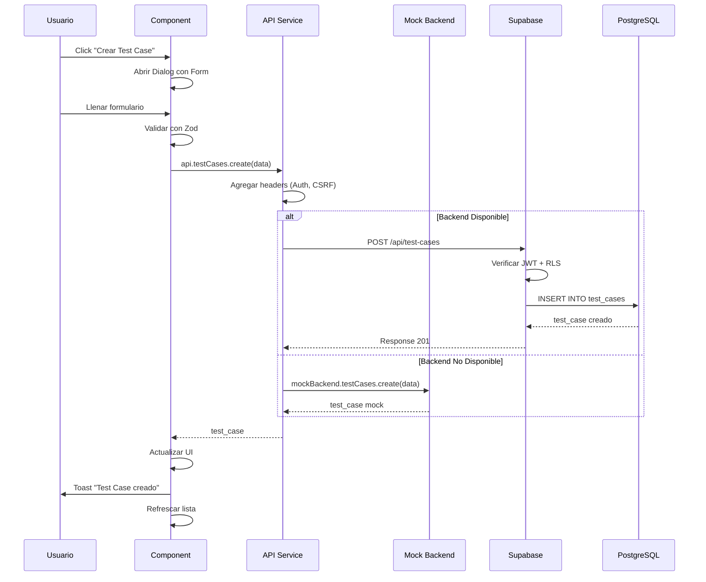

# 🏛️ 02 - Arquitectura

**Estructura completa del proyecto HAIDA**

---

## **📚 Tabla de Contenidos**

1. [Estructura de Carpetas](#estructura-de-carpetas)
2. [Arquitectura Frontend](#arquitectura-frontend)
3. [Servicios API](#servicios-api)
4. [Mock Backend](#mock-backend)
5. [Componentes UI](#componentes-ui)
6. [State Management](#state-management)
7. [Routing](#routing)
8. [Data Flow](#data-flow)

---

## **Estructura de Carpetas**

```
haida/
├── docs/                          # Documentación (este archivo)
│   ├── 00-MASTER-REFERENCE/
│   ├── 01-FUNDAMENTOS/
│   ├── 02-ARQUITECTURA/           # ← Estás aquí
│   ├── 03-GUIAS-DESARROLLO/
│   ├── 04-APIS/
│   ├── 05-BASE-DATOS/
│   ├── 06-SEGURIDAD/
│   ├── 07-DESPLIEGUE/
│   └── 08-MANTENIMIENTO/
│
├── src/
│   ├── app/
│   │   ├── components/            # Componentes React
│   │   │   ├── ui/                # Radix UI wrappers (47+ componentes)
│   │   │   ├── documentation/     # Wiki components
│   │   │   ├── chat/              # Chat IA components
│   │   │   ├── telegram/          # Telegram bot UI
│   │   │   ├── users/             # User management
│   │   │   └── ErrorBoundary.tsx  # Error handling global
│   │   │
│   │   ├── pages/                 # Páginas principales
│   │   │   ├── Dashboard.tsx      # Dashboard principal
│   │   │   ├── Projects.tsx       # Gestión de proyectos
│   │   │   ├── Designer.tsx       # Diseñador de tests
│   │   │   ├── Chat.tsx           # Chat IA (Microsoft 365 Copilot style)
│   │   │   ├── Users.tsx          # Gestión de usuarios y permisos
│   │   │   ├── Telegram.tsx       # Configuración del bot
│   │   │   ├── Login.tsx          # SSO Microsoft 365
│   │   │   └── ...
│   │   │
│   │   └── App.tsx                # App principal con routing
│   │
│   ├── services/                  # API Services
│   │   ├── api.ts                 # 🎯 API Central (9 módulos)
│   │   ├── mock-backend.ts        # Mock Backend automático
│   │   ├── telegram-api.ts        # Telegram Bot API
│   │   ├── jira-api.ts            # Jira Cloud API
│   │   ├── confluence-api.ts      # Confluence API
│   │   ├── auth-service.ts        # MSAL authentication
│   │   └── encryption-service.ts  # AES-256 encryption
│   │
│   ├── types/                     # TypeScript types
│   │   ├── database.types.ts      # ✨ Tipos generados de DB
│   │   ├── permissions.ts         # RBAC types
│   │   └── api.types.ts           # API response types
│   │
│   ├── lib/                       # Utilidades
│   │   ├── security-utils.ts      # Anti-XSS, ReDoS helpers
│   │   └── ...
│   │
│   ├── styles/                    # Estilos globales
│   │   ├── theme.css              # Tailwind v4 theme
│   │   ├── fonts.css              # Sora + IBM Plex Mono
│   │   └── index.css              # Entry point
│   │
│   └── main.tsx                   # Entry point
│
├── public/                        # Assets estáticos
│   └── ...
│
├── .env.local                     # Variables de entorno (NO commitear)
├── .env.example                   # Template de .env
├── package.json
├── vite.config.ts
├── tailwind.config.js             # Tailwind v4 config
└── tsconfig.json
```

---

## **Arquitectura Frontend**

### **Patrón: Feature-Based Structure**

Cada feature tiene su propia carpeta con:
- Componentes específicos
- Hooks personalizados
- Tipos locales
- Utils/helpers

```
src/app/components/telegram/
  ├── TelegramConfig.tsx        # Componente principal
  ├── TelegramCommandsList.tsx  # Lista de comandos
  ├── TelegramQRCode.tsx        # QR de vinculación
  ├── useTelegramNotifications.ts  # Hook personalizado
  └── telegram.types.ts         # Tipos locales
```

### **Composición de Componentes**

```tsx
// Ejemplo: Designer.tsx
<PageLayout>
  <PageHeader>
    <PageTitle>Diseñador de Tests</PageTitle>
    <PageActions>
      <Button>Nuevo Test</Button>
    </PageActions>
  </PageHeader>
  
  <PageContent>
    <Tabs>
      <TabsList>
        <TabsTrigger>Test Suites</TabsTrigger>
        <TabsTrigger>Test Cases</TabsTrigger>
      </TabsList>
      
      <TabsContent value="test-suites">
        <TestSuitesTable data={suites} />
      </TabsContent>
      
      <TabsContent value="test-cases">
        <TestCasesTable data={cases} />
      </TabsContent>
    </Tabs>
  </PageContent>
</PageLayout>
```

---

## **Servicios API**

### **API Central (`/src/services/api.ts`)**

Sistema unificado de APIs con **9 módulos**:

```typescript
export const api = {
  auth: {
    login: (credentials) => Promise<User>,
    logout: () => Promise<void>,
    getCurrentUser: () => Promise<User>,
  },
  
  projects: {
    getAll: () => Promise<Project[]>,
    getById: (id) => Promise<Project>,
    create: (data) => Promise<Project>,
    update: (id, data) => Promise<Project>,
    delete: (id) => Promise<void>,
  },
  
  testSuites: {
    getByProject: (projectId) => Promise<TestSuite[]>,
    create: (data) => Promise<TestSuite>,
    update: (id, data) => Promise<TestSuite>,
    delete: (id) => Promise<void>,
  },
  
  testCases: {
    getBySuite: (suiteId) => Promise<TestCase[]>,
    create: (data) => Promise<TestCase>,
    update: (id, data) => Promise<TestCase>,
    delete: (id) => Promise<void>,
  },
  
  executions: {
    getByProject: (projectId) => Promise<TestExecution[]>,
    trigger: (projectId, suiteIds) => Promise<TestExecution>,
    getResults: (executionId) => Promise<TestResult[]>,
  },
  
  defects: {
    getByProject: (projectId) => Promise<Defect[]>,
    create: (data) => Promise<Defect>,
    update: (id, data) => Promise<Defect>,
    linkToJira: (id, jiraKey) => Promise<void>,
  },
  
  chat: {
    createThread: (data) => Promise<ChatThread>,
    sendMessage: (threadId, content) => Promise<ChatMessage>,
    getThreads: (userId) => Promise<ChatThread[]>,
    getMessages: (threadId) => Promise<ChatMessage[]>,
  },
  
  users: {
    getAll: () => Promise<User[]>,
    getById: (id) => Promise<User>,
    create: (data) => Promise<User>,
    update: (id, data) => Promise<User>,
    updateRole: (id, role) => Promise<User>,
  },
  
  telegram: {
    getConfig: () => Promise<TelegramConfig>,
    updateConfig: (data) => Promise<TelegramConfig>,
    sendNotification: (message) => Promise<void>,
    getCommands: () => Promise<TelegramCommand[]>,
  },
};
```

### **Interceptors de Axios**

```typescript
// Request Interceptor
axiosInstance.interceptors.request.use(
  (config) => {
    // 1. Auth token
    const token = localStorage.getItem('supabase_token');
    if (token) {
      config.headers.Authorization = `Bearer ${token}`;
    }
    
    // 2. CSRF token
    if (['post', 'put', 'delete'].includes(config.method?.toLowerCase() || '')) {
      config.headers['X-CSRF-Token'] = csrfToken;
    }
    
    // 3. Tenant ID
    const tenantId = localStorage.getItem('current_tenant_id');
    if (tenantId) {
      config.headers['X-Tenant-ID'] = tenantId;
    }
    
    return config;
  }
);

// Response Interceptor
axiosInstance.interceptors.response.use(
  (response) => response,
  async (error) => {
    // 401: Redirect a login
    if (error.response?.status === 401) {
      window.location.href = '/login';
    }
    
    // 429: Rate limit exceeded
    if (error.response?.status === 429) {
      toast.error('Demasiadas requests. Espera un momento.');
    }
    
    return Promise.reject(error);
  }
);
```

---

## **Mock Backend**

### **Sistema Automático de Fallback**

Cuando el backend real no está disponible, HAIDA usa un **Mock Backend** que funciona silenciosamente.

```typescript
// /src/services/mock-backend.ts
export const mockBackend = {
  isActive: false,  // Se activa automáticamente si falla el backend real
  
  projects: {
    getAll: () => [
      {
        id: 'mock-1',
        name: 'E-Commerce Platform',
        slug: 'ecommerce',
        base_url: 'https://shop.example.com',
        status: 'active',
        owner_id: 'user-1',
        created_at: '2025-01-15T10:00:00Z',
      },
      // ... más proyectos mock
    ],
  },
  
  executions: {
    getByProject: (projectId) => [
      {
        id: 'exec-1',
        project_id: projectId,
        status: 'completed',
        total_tests: 45,
        passed_tests: 42,
        failed_tests: 3,
        started_at: '2025-01-20T08:00:00Z',
      },
    ],
  },
};
```

### **Auto-activación**

```typescript
// En api.ts
axiosInstance.interceptors.response.use(
  (response) => response,
  async (error) => {
    // Si el backend no responde, activar mock
    if (error.code === 'ERR_NETWORK' || error.response?.status === 503) {
      console.warn('⚠️ Backend no disponible. Usando Mock Backend.');
      mockBackend.isActive = true;
    }
    
    return Promise.reject(error);
  }
);
```

---

## **Componentes UI**

### **Sistema de Design Tokens**

```css
/* /src/styles/theme.css */
@theme {
  /* Colors */
  --color-ink: #1a1a1a;
  --color-sand: #f5f5f0;
  --color-signal-orange: #ff6b35;
  --color-teal: #00a896;
  --color-slate: #64748b;
  
  /* Typography */
  --font-sora: 'Sora', sans-serif;
  --font-mono: 'IBM Plex Mono', monospace;
  
  /* Spacing */
  --spacing-xs: 0.25rem;
  --spacing-sm: 0.5rem;
  --spacing-md: 1rem;
  --spacing-lg: 1.5rem;
  --spacing-xl: 2rem;
  
  /* Radius */
  --radius-sm: 0.25rem;
  --radius-md: 0.5rem;
  --radius-lg: 0.75rem;
  --radius-full: 9999px;
}
```

### **47+ Componentes Radix UI**

#### **Layout**
- `PageLayout` - Layout base con sidebar
- `PageHeader` - Header de página
- `PageContent` - Contenido principal

#### **Navigation**
- `NavigationMenu` - Menú principal
- `Sidebar` - Sidebar con items colapsables
- `Breadcrumb` - Navegación jerárquica
- `Tabs` - Pestañas de contenido

#### **Data Display**
- `Table` - Tablas con sorting y filtering
- `DataTable` - Tabla avanzada con paginación
- `Card` - Contenedor de información
- `Badge` - Etiquetas de estado
- `Avatar` - Imágenes de perfil
- `Skeleton` - Loading states

#### **Forms**
- `Input` - Campo de texto
- `Textarea` - Campo de texto multi-línea
- `Select` - Dropdown
- `Checkbox` - Casillas de verificación
- `RadioGroup` - Botones de radio
- `Switch` - Toggle
- `Slider` - Deslizador numérico
- `DatePicker` - Selector de fechas

#### **Feedback**
- `Dialog` - Modales
- `AlertDialog` - Confirmaciones
- `Toast` - Notificaciones flotantes (Sonner)
- `Popover` - Info contextual
- `Tooltip` - Ayudas rápidas
- `HoverCard` - Cards con info adicional
- `Progress` - Barras de progreso

#### **Charts (Recharts)**
- `LineChart` - Gráficas de línea
- `BarChart` - Gráficas de barras
- `PieChart` - Gráficas de pastel
- `AreaChart` - Gráficas de área

---

## **Servicios API**

### **Arquitectura de Servicios**

```
┌─────────────────────────────────────────┐
│         Frontend (React)                │
│                                         │
│  ┌───────────────────────────────────┐ │
│  │      API Service (/services/api)  │ │
│  │  • Auth                           │ │
│  │  • Projects                       │ │
│  │  • Test Suites                    │ │
│  │  • Test Cases                     │ │
│  │  • Executions                     │ │
│  │  • Defects                        │ │
│  │  • Chat                           │ │
│  │  • Users                          │ │
│  │  • Telegram                       │ │
│  └───────────────────────────────────┘ │
│                 │                       │
└─────────────────┼───────────────────────┘
                  │
                  │ REST/GraphQL
                  ▼
┌─────────────────────────────────────────┐
│         Supabase Backend                │
│                                         │
│  ┌───────────────────────────────────┐ │
│  │  PostgreSQL Database              │ │
│  │  • Tables (23)                    │ │
│  │  • Views (3)                      │ │
│  │  • Functions (10+)                │ │
│  │  • RLS Policies                   │ │
│  └───────────────────────────────────┘ │
│                                         │
│  ┌───────────────────────────────────┐ │
│  │  Auth (Supabase Auth)             │ │
│  │  • JWT tokens                     │ │
│  │  • SSO providers                  │ │
│  └───────────────────────────────────┘ │
│                                         │
│  ┌───────────────────────────────────┐ │
│  │  Storage (Supabase Storage)       │ │
│  │  • Screenshots                    │ │
│  │  • Videos                         │ │
│  │  • Reports                        │ │
│  └───────────────────────────────────┘ │
└─────────────────────────────────────────┘
```

### **Request/Response Flow**

```typescript
// 1. Component hace request
const projects = await api.projects.getAll();

// 2. API Service procesa
// /src/services/api.ts
export const api = {
  projects: {
    getAll: async () => {
      try {
        // Intenta backend real
        const response = await axiosInstance.get('/api/projects');
        return response.data;
      } catch (error) {
        // Fallback a Mock Backend
        if (mockBackend.isActive) {
          console.warn('Using mock data');
          return mockBackend.projects.getAll();
        }
        throw error;
      }
    },
  },
};

// 3. Axios interceptors agregan headers
// (Auth token, CSRF token, Tenant ID)

// 4. Supabase procesa con RLS
// (Solo devuelve datos del tenant del usuario)

// 5. Response vuelve al componente
```

---

## **State Management**

### **Estrategia Híbrida**

HAIDA usa **múltiples estrategias** según el caso de uso:

#### **1. React Context (Global State)**
```typescript
// /src/contexts/AuthContext.tsx
export const AuthContext = createContext<{
  user: User | null;
  tenant: Tenant | null;
  login: (credentials) => Promise<void>;
  logout: () => Promise<void>;
}>({});

// Uso
const { user, tenant } = useAuth();
```

#### **2. useState + useEffect (Local State)**
```typescript
// Para datos de página
const [projects, setProjects] = useState<Project[]>([]);
const [loading, setLoading] = useState(true);

useEffect(() => {
  api.projects.getAll().then(setProjects).finally(() => setLoading(false));
}, []);
```

#### **3. React Query (Server State) - Opcional**
```typescript
// Para caching y sincronización
const { data: projects, isLoading } = useQuery({
  queryKey: ['projects'],
  queryFn: () => api.projects.getAll(),
  staleTime: 5 * 60 * 1000,  // 5 minutos
});
```

---

## **Routing**

### **React Router v6**

```typescript
// /src/app/App.tsx
import { BrowserRouter, Routes, Route, Navigate } from 'react-router-dom';

export default function App() {
  return (
    <BrowserRouter>
      <Routes>
        {/* Public */}
        <Route path="/login" element={<Login />} />
        
        {/* Protected */}
        <Route element={<ProtectedRoute />}>
          <Route path="/" element={<Navigate to="/dashboard" />} />
          <Route path="/dashboard" element={<Dashboard />} />
          <Route path="/projects" element={<Projects />} />
          <Route path="/projects/:slug" element={<ProjectDetail />} />
          <Route path="/designer" element={<Designer />} />
          <Route path="/chat" element={<Chat />} />
          <Route path="/users" element={<Users />} />
          <Route path="/settings" element={<Settings />} />
          
          {/* 404 */}
          <Route path="*" element={<NotFound />} />
        </Route>
      </Routes>
    </BrowserRouter>
  );
}
```

### **Protected Routes**

```typescript
// ProtectedRoute component
function ProtectedRoute() {
  const { user, loading } = useAuth();
  
  if (loading) {
    return <LoadingScreen />;
  }
  
  if (!user) {
    return <Navigate to="/login" replace />;
  }
  
  return <Outlet />;
}
```

---

## **Data Flow**

### **Flujo Completo: Crear Test Case**



---

## **Patrones de Diseño Usados**

### **1. Repository Pattern**
Toda la lógica de datos está en servicios centralizados (`/src/services/`)

### **2. Compound Components**
Componentes compuestos para flexibilidad (ej: `<Tabs>`, `<Select>`)

### **3. Custom Hooks**
Lógica reutilizable encapsulada en hooks:
```typescript
// useTelegramNotifications.ts
export function useTelegramNotifications() {
  const [enabled, setEnabled] = useState(false);
  
  const sendNotification = async (message: string) => {
    if (!enabled) return;
    await api.telegram.sendNotification(message);
  };
  
  return { enabled, setEnabled, sendNotification };
}
```

### **4. Error Boundaries**
Captura de errores a nivel de árbol de componentes

### **5. Render Props (ocasional)**
Para componentes altamente personalizables

---

## **Performance**

### **Code Splitting**

```typescript
// Lazy loading de páginas
const Dashboard = lazy(() => import('@/app/pages/Dashboard'));
const Designer = lazy(() => import('@/app/pages/Designer'));
const Chat = lazy(() => import('@/app/pages/Chat'));

// Suspense wrapper
<Suspense fallback={<LoadingScreen />}>
  <Routes>
    <Route path="/dashboard" element={<Dashboard />} />
    <Route path="/designer" element={<Designer />} />
    <Route path="/chat" element={<Chat />} />
  </Routes>
</Suspense>
```

### **Memoization**

```typescript
// useMemo para cálculos costosos
const sortedProjects = useMemo(() => {
  return projects.sort((a, b) => 
    new Date(b.created_at).getTime() - new Date(a.created_at).getTime()
  );
}, [projects]);

// useCallback para funciones estables
const handleCreate = useCallback(async (data: InsertProject) => {
  await api.projects.create(data);
  refetch();
}, [refetch]);
```

---

## **Testing**

### **Unit Tests (Vitest)**

```typescript
// /src/services/__tests__/api.test.ts
import { describe, it, expect, vi } from 'vitest';
import { api } from '@/services/api';

describe('API Service', () => {
  it('should fetch projects', async () => {
    const projects = await api.projects.getAll();
    expect(projects).toBeInstanceOf(Array);
  });
  
  it('should handle errors', async () => {
    vi.spyOn(axios, 'get').mockRejectedValue(new Error('Network error'));
    
    await expect(api.projects.getAll()).rejects.toThrow('Network error');
  });
});
```

### **Integration Tests (Playwright)**

```typescript
// /tests/e2e/projects.spec.ts
import { test, expect } from '@playwright/test';

test('user can create project', async ({ page }) => {
  await page.goto('/projects');
  
  await page.click('button:has-text("Nuevo Proyecto")');
  await page.fill('input[name="name"]', 'Test Project');
  await page.fill('input[name="slug"]', 'test-project');
  await page.click('button:has-text("Guardar")');
  
  await expect(page.locator('text=Test Project')).toBeVisible();
});
```

---

## **Build & Bundle**

### **Vite Configuration**

```typescript
// vite.config.ts
import { defineConfig } from 'vite';
import react from '@vitejs/plugin-react';
import path from 'path';

export default defineConfig({
  plugins: [react()],
  
  resolve: {
    alias: {
      '@': path.resolve(__dirname, './src'),
    },
  },
  
  build: {
    rollupOptions: {
      output: {
        manualChunks: {
          'vendor-react': ['react', 'react-dom', 'react-router-dom'],
          'vendor-radix': ['@radix-ui/react-dialog', '@radix-ui/react-dropdown-menu'],
          'vendor-charts': ['recharts'],
        },
      },
    },
  },
  
  server: {
    port: 5173,
    proxy: {
      '/api': {
        target: 'http://localhost:3000',
        changeOrigin: true,
      },
    },
  },
});
```

### **Bundle Analysis**

```bash
# Analizar tamaño del bundle
npm run build
npm run analyze  # (si está configurado)

# Resultado esperado:
# vendor-react.js     ~150KB
# vendor-radix.js     ~80KB
# vendor-charts.js    ~120KB
# main.js             ~200KB
# Total:              ~550KB (gzipped)
```

---

**Anterior**: [← 01 - Fundamentos](../01-FUNDAMENTOS/README.md)  
**Siguiente**: [03 - Guías de Desarrollo →](../03-GUIAS-DESARROLLO/README.md)

---

**Última actualización**: 2025-01-20  
**Versión HAIDA**: 1.0.0
