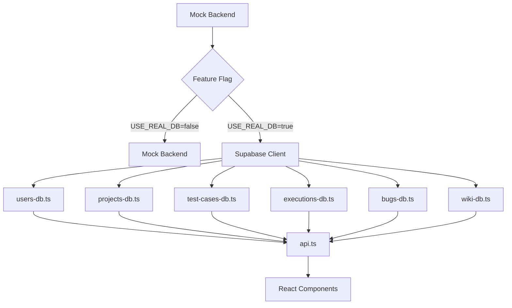

# 🗄️ Base de Datos - HAIDA

**Documentación completa de la base de datos PostgreSQL/Supabase**

---

## 📚 Guías Completas

### 🚀 [01 - Migración de Mock a Database Real](./01-MIGRACION-MOCK-A-DATABASE.md)
Guía paso a paso para migrar desde el Mock Backend hacia PostgreSQL/Supabase.

**Contenido:**
- ✅ Configuración de Supabase Client
- ✅ Patrón Adapter para cada módulo
- ✅ Feature Flags para migración gradual
- ✅ Testing y validación
- ✅ Troubleshooting común

**Cuándo usar:** Cuando estés listo para conectar la aplicación a la base de datos real.

---

### 📝 [02 - Tipos TypeScript](./02-TIPOS-TYPESCRIPT.md)
Guía completa de los tipos TypeScript generados automáticamente desde el schema.

**Contenido:**
- ✅ Estructura de tipos (Row, Insert, Update, Relationships)
- ✅ Tipos por cada tabla (Users, Roles, Projects, Test Cases, etc.)
- ✅ Helpers y type aliases
- ✅ Enums TypeScript
- ✅ Best practices de tipado
- ✅ Cómo regenerar tipos

**Cuándo usar:** Para escribir código type-safe que interactúe con la database.

---

### 🔍 [03 - Consultas SQL](./03-CONSULTAS-SQL.md)
Ejemplos prácticos de queries con Supabase JS Client.

**Contenido:**
- ✅ Queries básicas (CRUD) por tabla
- ✅ Queries con relaciones (JOINs)
- ✅ Queries usando vistas (user_effective_permissions, project_team_members, wiki_page_hierarchy)
- ✅ Queries de permisos
- ✅ Queries avanzadas (búsqueda, filtros, agregaciones, paginación)
- ✅ Queries de estadísticas (dashboards)
- ✅ Optimización de queries

**Cuándo usar:** Cuando necesites ejemplos de cómo consultar la base de datos.

---

### 🔗 [04 - Relaciones de Database](./04-RELACIONES-DATABASE.md)
Documentación completa de todas las relaciones entre tablas.

**Contenido:**
- ✅ Mapa visual de relaciones
- ✅ Relaciones detalladas por entidad
- ✅ Patrones de relación (Many-to-Many, Auto-Referencia, Herencia)
- ✅ Ejemplos de código con relaciones
- ✅ Foreign Keys y CASCADE rules
- ✅ UNIQUE constraints
- ✅ Best practices

**Cuándo usar:** Para entender cómo se conectan las tablas entre sí.

---

### 💻 [05 - Ejemplos Prácticos de Integración](./05-EJEMPLOS-INTEGRACION.md)
Ejemplos completos de código para integrar la database en tu aplicación.

**Contenido:**
- ✅ Setup inicial (Cliente Supabase)
- ✅ Service layers completos (users, projects, test cases, executions, permisos, wiki)
- ✅ Componentes React con database
- ✅ Custom React Hooks (useEntity, usePermissions)
- ✅ Error handling centralizado
- ✅ Ejemplos end-to-end

**Cuándo usar:** Para copiar código funcional e implementar features con la database.

---

### 📄 [CHEAT SHEET - Referencia Rápida](./CHEAT-SHEET.md)
Referencia rápida de una página con los comandos y patterns más usados.

**Contenido:**
- ✅ Setup en 3 pasos
- ✅ Queries comunes (SELECT, INSERT, UPDATE, DELETE)
- ✅ Uso de vistas
- ✅ Tipos TypeScript esenciales
- ✅ Error handling
- ✅ React Hook ejemplo
- ✅ Service layer pattern

**Cuándo usar:** Como referencia rápida mientras desarrollas.

---

## 🗺️ Arquitectura de Database

### Schema Completo

La base de datos HAIDA tiene:

- **23 tablas** principales
- **3 vistas** SQL (permisos efectivos, miembros de proyecto, jerarquía wiki)
- **Múltiples relaciones** con Foreign Keys
- **Row Level Security (RLS)** para multi-tenancy

### Diagrama ER Completo

Ver el diagrama visual completo en Mermaid en: [`/HAIDA_DATABASE_DIAGRAM.md`](/HAIDA_DATABASE_DIAGRAM.md)

```
┌─────────────────────────────────────────────────────────────┐
│                  USUARIOS Y PERMISOS                        │
│  users → roles → permissions (via role_permissions)         │
│    │                                                         │
│    ├─→ project_members ←─ projects                          │
│    │                                                         │
│    └─→ created entities (test_cases, bugs, wiki_pages...)   │
└─────────────────────────────────────────────────────────────┘

┌─────────────────────────────────────────────────────────────┐
│                        PROYECTOS                            │
│  projects → test_cases → test_case_steps                    │
│          → executions → execution_results                    │
│          → bugs → bug_attachments                            │
│          → wiki_pages (auto-referencia) → wiki_page_versions │
│          → integrations                                      │
└─────────────────────────────────────────────────────────────┘
```

---

## 📊 Tablas Principales

### Core: Usuarios y Autenticación

| Tabla | Descripción | Relaciones |
|-------|-------------|-----------|
| **`users`** | Usuarios de la plataforma | → `roles` (global_role)<br>→ `project_members`<br>→ `projects` (created_by) |
| **`roles`** | Roles globales y de proyecto | → `role_permissions`<br>← `users`<br>← `project_members` |
| **`permissions`** | Permisos granulares | → `role_permissions` |
| **`role_permissions`** | Tabla de unión Roles-Permisos | ← `roles`<br>← `permissions` |

### Proyectos y Equipos

| Tabla | Descripción | Relaciones |
|-------|-------------|-----------|
| **`projects`** | Proyectos de QA | ← `users` (created_by)<br>→ `project_members`<br>→ test_cases, executions, bugs, wiki |
| **`project_members`** | Miembros del equipo | ← `projects`<br>← `users`<br>← `roles` |

### Testing

| Tabla | Descripción | Relaciones |
|-------|-------------|-----------|
| **`test_cases`** | Casos de prueba | ← `projects`<br>→ `test_case_steps`<br>→ `execution_results` |
| **`test_case_steps`** | Pasos de test cases | ← `test_cases` (CASCADE) |
| **`executions`** | Ejecuciones de tests | ← `projects`<br>→ `execution_results` |
| **`execution_results`** | Resultados individuales | ← `executions` (CASCADE)<br>← `test_cases`<br>→ `bugs` |

### Bugs y Defectos

| Tabla | Descripción | Relaciones |
|-------|-------------|-----------|
| **`bugs`** | Bugs detectados | ← `projects`<br>← `users` (reported_by, assigned_to)<br>← `execution_results`<br>→ `bug_attachments` |
| **`bug_attachments`** | Archivos adjuntos | ← `bugs` (CASCADE) |

### Wiki y Documentación

| Tabla | Descripción | Relaciones |
|-------|-------------|-----------|
| **`wiki_pages`** | Páginas de wiki | ← `projects`<br>← `wiki_pages` (parent, auto-ref)<br>→ `wiki_page_versions` |
| **`wiki_page_versions`** | Historial de versiones | ← `wiki_pages` (CASCADE) |

### Integraciones

| Tabla | Descripción | Relaciones |
|-------|-------------|-----------|
| **`integrations`** | Configuración de integraciones | ← `projects` |

---

## 🔎 Vistas SQL

### `user_effective_permissions`

Calcula TODOS los permisos efectivos de un usuario (globales + por proyecto).

**Columnas:**
- `user_id`, `permission_id`, `permission_name`
- `resource`, `action`
- `source` ('global' | 'project')
- `role_id`, `role_name`
- `project_id` (null para globales)

**Uso:**
```typescript
const { data: permissions } = await supabase
  .from('user_effective_permissions')
  .select('*')
  .eq('user_id', userId);
```

---

### `project_team_members`

Vista desnormalizada de miembros de proyectos con información completa.

**Columnas:**
- `project_id`, `project_name`
- `user_id`, `user_name`, `user_email`, `user_avatar`
- `role_id`, `role_name`

**Uso:**
```typescript
const { data: team } = await supabase
  .from('project_team_members')
  .select('*')
  .eq('project_id', projectId);
```

---

### `wiki_page_hierarchy`

Jerarquía completa de páginas wiki con path calculado.

**Columnas:**
- `page_id`, `page_title`
- `project_id`
- `parent_page_id`
- `layer` (strategic/tactical/operational/technical)
- `level` (profundidad en el árbol)
- `path` (ej: "Documentation > API Guide > Auth")

**Uso:**
```typescript
const { data: wikiTree } = await supabase
  .from('wiki_page_hierarchy')
  .select('*')
  .eq('project_id', projectId)
  .order('path');
```

---

## 🔐 Permisos y RLS

### Sistema de Permisos de 3 Niveles

1. **Rol Global** (`users.global_role_id`)
   - Asignado a cada usuario
   - Permisos que aplican a toda la aplicación

2. **Rol de Proyecto** (`project_members.role_id`)
   - Asignado por proyecto
   - Permisos específicos del proyecto

3. **Permisos Efectivos** (Vista `user_effective_permissions`)
   - Unión de permisos globales + de proyecto
   - Calculada automáticamente

### Verificar Permisos

```typescript
// Helper function
async function userHasPermission(
  userId: string,
  permissionName: string,
  projectId?: string
): Promise<boolean> {
  const { data } = await supabase
    .from('user_effective_permissions')
    .select('*')
    .eq('user_id', userId)
    .eq('permission_name', permissionName);
  
  if (!data || data.length === 0) return false;
  
  // Si no hay projectId, cualquier permiso es válido
  if (!projectId) return true;
  
  // Buscar permiso global O permiso específico del proyecto
  return data.some(p => 
    p.source === 'global' || p.project_id === projectId
  );
}
```

---

## 📦 Tipos TypeScript

### Ubicación
`/src/types/database.types.ts`

### Estructura

```typescript
export interface Database {
  public: {
    Tables: {
      users: {
        Row: { ... }      // Tipo de lectura
        Insert: { ... }   // Tipo de inserción
        Update: { ... }   // Tipo de actualización
      }
      // ... 22 tablas más
    }
    Views: {
      user_effective_permissions: { Row: { ... } }
      project_team_members: { Row: { ... } }
      wiki_page_hierarchy: { Row: { ... } }
    }
    Functions: { ... }
    Enums: { ... }
  }
}
```

### Uso Básico

```typescript
import type { Database } from '@/types/database.types';

type User = Database['public']['Tables']['users']['Row'];
type UserInsert = Database['public']['Tables']['users']['Insert'];
type UserUpdate = Database['public']['Tables']['users']['Update'];

// En función
async function createUser(user: UserInsert): Promise<User> {
  const { data, error } = await supabase
    .from('users')
    .insert(user)
    .select()
    .single();
  
  if (error) throw error;
  return data;
}
```

Ver guía completa: [02-TIPOS-TYPESCRIPT.md](./02-TIPOS-TYPESCRIPT.md)

---

## 🚀 Quick Start

### 1. Ver el Schema
```bash
# Lee el archivo exportado
cat HAIDA_DATABASE_DIAGRAM.md
cat DATABASE_RELATIONS_GUIDE.md
```

### 2. Configurar Supabase

```typescript
// /src/services/supabase-client.ts
import { createClient } from '@supabase/supabase-js';
import type { Database } from '@/types/database.types';

export const supabase = createClient<Database>(
  import.meta.env.VITE_SUPABASE_URL,
  import.meta.env.VITE_SUPABASE_ANON_KEY
);
```

### 3. Hacer tu Primera Query

```typescript
// Obtener usuarios
const { data: users } = await supabase
  .from('users')
  .select('*')
  .eq('status', 'active');

// Obtener usuario con rol
const { data: userWithRole } = await supabase
  .from('users')
  .select(`
    *,
    global_role:roles(*)
  `)
  .eq('id', userId)
  .single();

// Verificar permiso
const { data: hasPermission } = await supabase
  .from('user_effective_permissions')
  .select('*')
  .eq('user_id', userId)
  .eq('permission_name', 'projects.create')
  .maybeSingle();
```

---

## 📚 Recursos Externos

### Documentación Oficial
- [Supabase Docs](https://supabase.com/docs)
- [PostgreSQL Docs](https://www.postgresql.org/docs/)
- [Supabase JS Client](https://supabase.com/docs/reference/javascript/introduction)

### Diagramas y Guías
- [Diagrama ER Visual](/HAIDA_DATABASE_DIAGRAM.md)
- [Guía de Relaciones Completa](/DATABASE_RELATIONS_GUIDE.md)
- [Quick Start Backend](/QUICK_START_BACKEND.md)

### Tipos y API
- [Tipos TypeScript](/src/types/database.types.ts)
- [API Service](/src/services/api.ts)
- [Mock Backend (referencia)](/src/services/mock-backend.ts)

---

## 🔄 Flujo de Migración



---

## ✅ Checklist de Implementación

- [x] **Schema completo exportado** (23 tablas, 3 vistas)
- [x] **Tipos TypeScript generados** (`/src/types/database.types.ts`)
- [x] **Diagramas ER creados** (`HAIDA_DATABASE_DIAGRAM.md`)
- [x] **Relaciones documentadas** (`DATABASE_RELATIONS_GUIDE.md`)
- [ ] **Supabase Client configurado** (`/src/services/supabase-client.ts`)
- [ ] **Database adapters creados** (`/src/services/database/*.ts`)
- [ ] **API service actualizado** (Feature flag para migración gradual)
- [ ] **Tests de integración** (Validar queries y relaciones)
- [ ] **Migración completa** (Mock → Database real)

---

## 🎯 Próximos Pasos

1. **Leer las guías:**
   - [01 - Migración Mock → Database](./01-MIGRACION-MOCK-A-DATABASE.md)
   - [02 - Tipos TypeScript](./02-TIPOS-TYPESCRIPT.md)
   - [03 - Consultas SQL](./03-CONSULTAS-SQL.md)
   - [04 - Relaciones](./04-RELACIONES-DATABASE.md)

2. **Configurar Supabase:**
   - Instalar `@supabase/supabase-js`
   - Configurar environment variables
   - Crear cliente tipado

3. **Comenzar migración:**
   - Empezar con módulo de Users
   - Usar patrón Adapter
   - Feature flag para rollback

4. **Testing:**
   - Validar queries
   - Verificar relaciones
   - Comparar con mock

---

**Siguiente:** [06 - Seguridad →](../06-SEGURIDAD/README.md)

---

**Última actualización:** Enero 2026  
**Mantenido por:** Equipo HAIDA  
**Versión Database:** PostgreSQL 15 (Supabase)