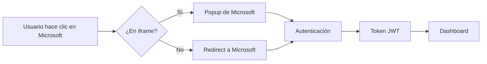
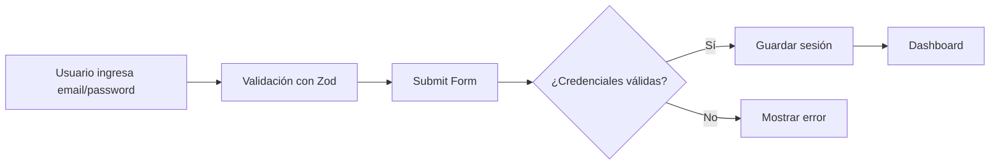

# 🔐 Guía de Autenticación HAIDA

## Descripción General

HAIDA implementa un **sistema de autenticación dual** que soporta:

1. **SSO con Microsoft 365 / Entra ID** - Para autenticación empresarial
2. **Login Manual con Email/Contraseña** - Para usuarios locales

---

## 🎯 Características Implementadas

### ✅ Microsoft 365 SSO
- ✨ Autenticación OAuth 2.0 con Microsoft Entra ID
- 🔄 Dual-flow: Popup (iframe) y Redirect (ventana normal)
- 🔒 Adquisición de tokens silenciosa e interactiva
- 🚪 Logout con redirección

### ✅ Login Manual
- 📧 Formulario de email/contraseña con validación
- 👁️ Toggle para mostrar/ocultar contraseña
- ✔️ Checkbox "Recordarme por 30 días"
- 🔐 Validación con Zod y React Hook Form
- 🔑 Diálogo de recuperación de contraseña

### ✅ UI/UX
- 🎨 Diseño glassmorphic con GlassCard de Radix UI
- 📱 Completamente responsive
- 🌙 Soporte para modo oscuro
- ⚡ Animaciones suaves con Tailwind CSS
- 🚨 Manejo de errores con alertas y toasts
- ⚠️ Banner informativo para modo preview/iframe

---

## 🔑 Cuentas de Prueba

Actualmente el sistema usa **mock data** para demostración:

```typescript
// Usuarios de prueba
admin@haida.com / admin123
user@haida.com / user123
demo@haida.com / demo123
```

---

## 🏗️ Arquitectura

### Componentes Principales

#### 1. **AuthProvider** (`/src/app/context/auth-context.tsx`)
Contexto global que maneja el estado de autenticación.

```typescript
interface User {
  name: string;
  email: string;
  id: string;
  photo?: string;
  authMethod?: 'microsoft' | 'manual';
}

interface AuthContextType {
  isAuthenticated: boolean;
  user: User | null;
  loading: boolean;
  login: () => Promise<void>;              // Microsoft SSO
  manualLogin: (email, password) => Promise<void>;  // Login manual
  logout: () => void;
  acquireToken: (scopes) => Promise<string>;
  isInIframe: boolean;
  ready: boolean;
}
```

#### 2. **Login Component** (`/src/app/pages/Login.tsx`)
Página de login con UI dual.

**Características:**
- Formulario de email/password con validación
- Botón de SSO de Microsoft con icono corporativo
- Separador visual "O continuar con"
- Diálogo modal para recuperación de contraseña
- Alertas contextuales (errores, iframe warning, cuentas de prueba)

#### 3. **MSAL Configuration** (`/src/auth/msal-config.ts`)
Configuración de Microsoft Authentication Library.

---

## 🚀 Integración con Supabase (Próximos Pasos)

### ¿Por qué Supabase?

Para hacer el login manual **funcional en producción**, necesitas:
- 🗄️ Base de datos para almacenar usuarios
- 🔐 Hash seguro de contraseñas (bcrypt)
- 📧 Envío de emails de recuperación
- 🔑 Gestión de tokens y sesiones
- 🛡️ Políticas de seguridad (RLS)

**Supabase proporciona todo esto out-of-the-box.**

### Plan de Integración

#### Paso 1: Instalar Supabase Client
```bash
npm install @supabase/supabase-js
```

#### Paso 2: Configurar Supabase
```typescript
// src/lib/supabase.ts
import { createClient } from '@supabase/supabase-js'

const supabaseUrl = import.meta.env.VITE_SUPABASE_URL
const supabaseAnonKey = import.meta.env.VITE_SUPABASE_ANON_KEY

export const supabase = createClient(supabaseUrl, supabaseAnonKey)
```

#### Paso 3: Actualizar AuthContext

```typescript
// En manualLogin function
const manualLogin = useCallback(async (email: string, password: string) => {
  setLoading(true);
  
  const { data, error } = await supabase.auth.signInWithPassword({
    email,
    password,
  });

  if (error) {
    setLoading(false);
    throw new Error(error.message);
  }

  if (data.user) {
    setManualUser({
      name: data.user.user_metadata.name || data.user.email,
      email: data.user.email,
      id: data.user.id,
      authMethod: 'manual',
    });
  }
  
  setLoading(false);
}, []);
```

#### Paso 4: Implementar Recuperación de Contraseña

```typescript
// En handleForgotPassword
const { error } = await supabase.auth.resetPasswordForEmail(email, {
  redirectTo: `${window.location.origin}/reset-password`,
});

if (error) throw error;
```

#### Paso 5: Crear Tabla de Usuarios Extendida

```sql
-- En Supabase SQL Editor
CREATE TABLE user_profiles (
  id UUID REFERENCES auth.users PRIMARY KEY,
  name TEXT,
  role TEXT DEFAULT 'user',
  created_at TIMESTAMP WITH TIME ZONE DEFAULT NOW(),
  updated_at TIMESTAMP WITH TIME ZONE DEFAULT NOW()
);

-- Enable Row Level Security
ALTER TABLE user_profiles ENABLE ROW LEVEL SECURITY;

-- Policy: Users can only read their own profile
CREATE POLICY "Users can view own profile" 
  ON user_profiles FOR SELECT 
  USING (auth.uid() = id);
```

---

## 🔒 Seguridad

### Implementado
- ✅ Validación de formularios con Zod
- ✅ HTTPS requerido en producción (MSAL)
- ✅ Tokens de acceso con Microsoft Graph
- ✅ Logout seguro con limpieza de sesión

### Por Implementar (con Supabase)
- ⏳ Hash de contraseñas con bcrypt
- ⏳ Rate limiting para prevenir brute force
- ⏳ Verificación de email obligatoria
- ⏳ 2FA (Two-Factor Authentication)
- ⏳ Auditoría de logs de acceso

---

## 📋 Flujo de Usuario

### Login con Microsoft 365


### Login Manual


---

## 🎨 Personalización

### Cambiar Textos
Edita el archivo `/src/app/lib/ui-context.tsx`:

```typescript
const DEFAULT_UI_CONFIG: UiConfig = {
  login: {
    title: "Welcome Back",
    subtitle: "Enter your credentials to access your QA workspace",
    emailPlaceholder: "name@example.com",
    passwordPlaceholder: "Password",
    rememberMeText: "Remember for 30 days",
    signInButtonText: "Sign In",
    forgotPasswordText: "Forgot password?",
    microsoftButtonText: "Microsoft Entra ID",
    // ...
  }
}
```

### Cambiar Estilos
Los estilos usan Tailwind CSS v4. Personaliza en `/src/styles/theme.css`:

```css
@theme {
  --color-primary: oklch(0.65 0.24 260);
  --radius-lg: 0.5rem;
  /* ... */
}
```

---

## 🐛 Troubleshooting

### Error: "redirect_in_iframe"
✅ **Solucionado:** La app detecta automáticamente iframes y usa popup flow.

### Error: "useAuth must be used within an AuthProvider"
✅ **Solucionado:** Safe defaults durante hot-reload de desarrollo.

### Error: "Popup blocked"
**Solución:** El usuario debe permitir popups o abrir en nueva pestaña. La UI muestra un banner informativo.

### Login manual no funciona
**Causa:** Estás usando mock data.
**Solución:** Integra con Supabase siguiendo la sección "Integración con Supabase".

---

## 📚 Referencias

- [Microsoft MSAL.js Documentation](https://github.com/AzureAD/microsoft-authentication-library-for-js)
- [Supabase Auth Documentation](https://supabase.com/docs/guides/auth)
- [React Hook Form](https://react-hook-form.com/)
- [Zod Validation](https://zod.dev/)
- [Radix UI](https://www.radix-ui.com/)

---

## 🤝 Contribuir

Para agregar nuevos métodos de autenticación:

1. Actualiza el tipo `AuthMethod` en `auth-context.tsx`
2. Agrega la lógica de login en `AuthProvider`
3. Actualiza el UI en `Login.tsx`
4. Documenta el proceso en esta guía

---

## 📝 Notas

- **Figma Make Preview:** Usa popup flow automáticamente
- **Producción:** Usa redirect flow para mejor UX
- **Mock Data:** Solo para demostración, no usar en producción
- **Supabase:** Recomendado para autenticación real y gestión de usuarios

---

✨ **Desarrollado con ❤️ para HAIDA**
